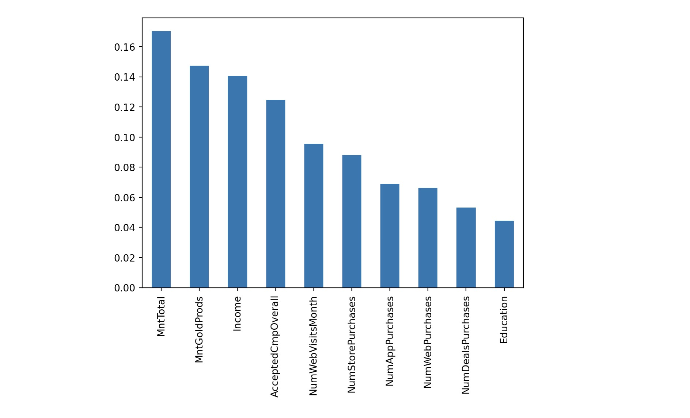

# Campaign Response Predictor
> [🌐 View Project](../assets/321-Lab-4.html)

*A supervised learning pipeline predicting customer responsiveness to marketing campaigns*

### Key Features

- End-to-end classification pipeline with data cleaning, feature engineering, and model tuning
- Compared Decision Tree and Random Forest classifiers across accuracy, F1, and AUC-ROC
- Identified income and spending as top predictors; flagged ethical implications of financial bias

### Technology Used

- Python · Scikit-learn · Pandas · Matplotlib
- RandomizedSearchCV & GridSearchCV for hyperparameter tuning
- Pipelines with StandardScaler, OrdinalEncoder, OneHotEncoder via ColumnTransformer

---