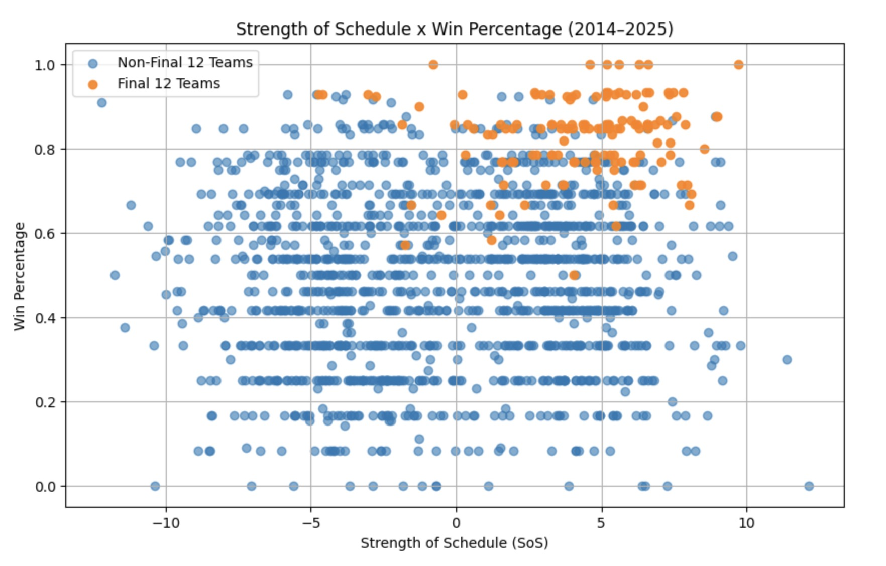

# College Football Playoff Predictor
> [🌐 Kaggle Notebook](https://www.kaggle.com/code/peytonpope/college-football-playoff-predictor)

## Objective
A machine-learning based predictor for College Football Playoff outcomes built in a Kaggle notebook. The project uses historical college football data to model team performance and estimate playoff participation.

## Technology used
- Random Forest Classifier
- XGBoost Classifier
- Pandas, NumPy, Scikit-learn

## Skills Developed
- Data preprocessing and feature engineering from historical season data  
- Trains and evaluates a predictive model for CFP selection
- Generates probabilities and comparative insights for playoff teams  

---

_View the_ [Source Code](https://github.com/peytonjpope/cfp-ML)  