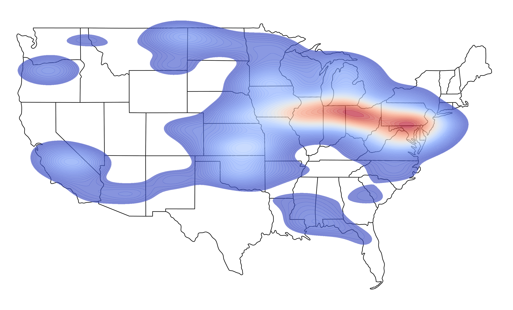

# Church Map: Data Science
> [🌐 View Project](https://github.com/peytonjpope/ChurchDataScience/blob/main/README.md)

*A data science project mapping 200,000+ US churches by denomination, scraped and visualized to show geographical distributions across the United States.*

## Objectives

- **Collect and organize church data** by scraping a large dataset (200k+ entries) with location coordinates.  
- **Classify and filter churches by denomination** using string matching and data cleaning.  
- **Visualize geographical patterns** of church presence using dot and contour plots on a US map.  

## Tech Used
- Python with
    - BeautifulSoup (web scraping)
    - Pandas (data manipulation), 
    - Matplotlib & Seaborn (visualization)  

## Skills Developed
- Web scraping and automation  
- Large dataset cleaning and manipulation   
- Data visualization (dot maps, contour maps)  

---

_View the_ [Source Code](https://github.com/peytonjpope/ChurchDataScience)  
