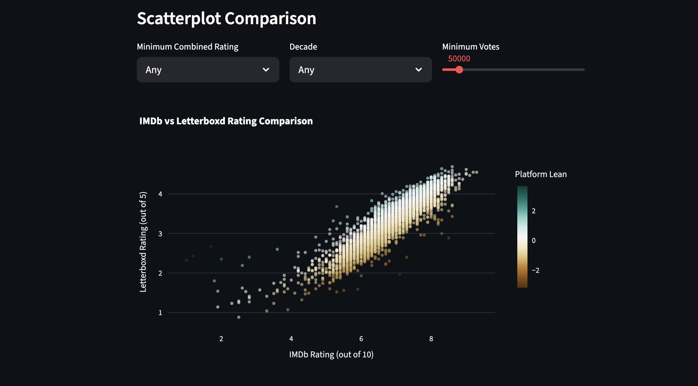

# PMDb

> [🌐 Live Application](https://pmoviedb.streamlit.app)

*Interactive web app showcasing a Snowflake database of 37,000+ films with IMDb and Letterboxd ratings*

---

## Features

* **Explore film rankings across multiple rating systems** with leaderboards filtering by decade, popularity, and rating

* **Compare IMDb vs Letterboxd lean** using rating differentials to highlight where the platforms disagree most

---

## Data Pipeline Architecture

| Layer | Tool | Description |
|---|---|---|
| **Ingestion** | Python, Snowflake Connector | Python script loading raw Kaggle datasets into Snowflake database as *bronze* tables |
| **Modeling** | dbt Core | Standardize types and filter nulls to create *silver* tables, Join both platforms on title + year then compute composite ratings and differentials into *gold* table |
| **Presentation** | Streamlit, Plotly, Snowflake SQLAlchemy | Query Gold table live from Snowflake and render interactive charts and film lookup |

---

*View the* [Source Code](https://github.com/peytonjpope/pmdb)
