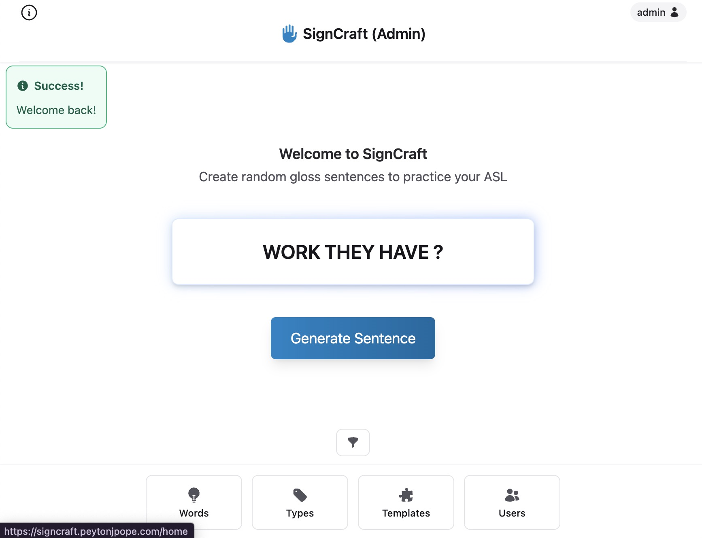

# SignCraft
> [🌐 View Website](https://signcraft.peytonjpope.com)

*A resource for ASL learners to maintain vocabulary and practice grammar, with the intention of promoting Deaf community engagement*

## Objectives

- **Grow and maintain your ASL vocabulary** with word bank for review and long-term retention.

- **Practice ASL-specific grammar patterns** through contextual sentence building that reflects natural language use.

- **Promote engagement with the Deaf community** and culture by learning vocabulary and expressions rooted in real-world, culturally relevant contexts.

## Technical used
- Backend Framework: Phoenix (Elixir/Erlang)
- Database: PostgreSQL with Ecto
- Frontend: Phoenix HEEX with Tailwind CSS
- Deployment: Fly.io with Docker

## Skills developed
- Database relationships and migrations
- Web app framework
- RDMS deployment
---

_View the_ [Source Code](https://github.com/peytonjpope/signcraft)
