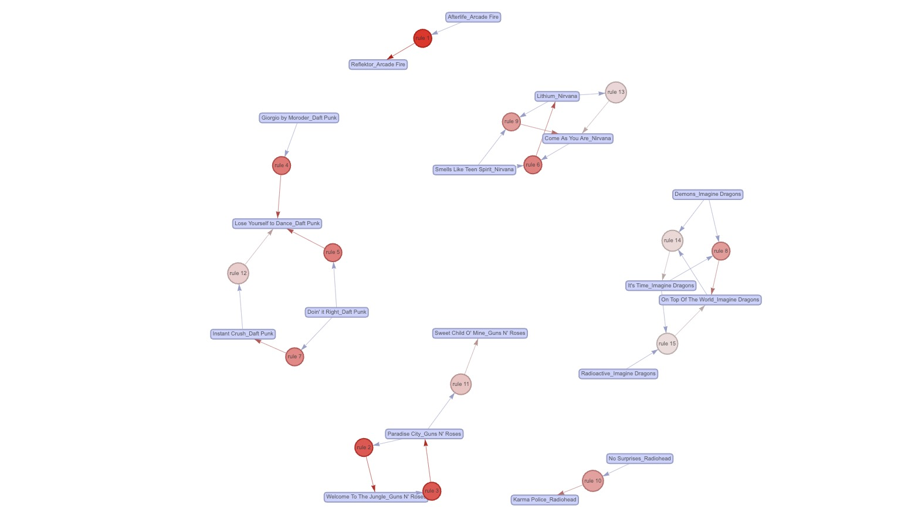

# Spotify Pattern Mining Recommendations
> [🌐 View Project](../assets/321-Lab-7.html)

*Market basket analysis on 1M+ Spotify listening records to surface high-confidence music recommendation rules*

### Key Features

- Built three transaction sets (artist, track, artist+track) from 742K cleaned Spotify records using user-level market basket framing
- Compared Apriori and ECLAT algorithms across speed, memory, and rule quality — Apriori won both benchmarks
- Surfaced top rules by lift (e.g. Daft Punk catalog co-listens, genre clusters like hip-hop and pop trios) with actionable recommendation pitch

### Technology Used

- R · arules · arulesViz · dplyr · ggplot2 · plotly · Quarto
- Apriori & ECLAT with support/confidence/lift tuning
- Memory profiling via Rprofmem and process timing via proc.time

---