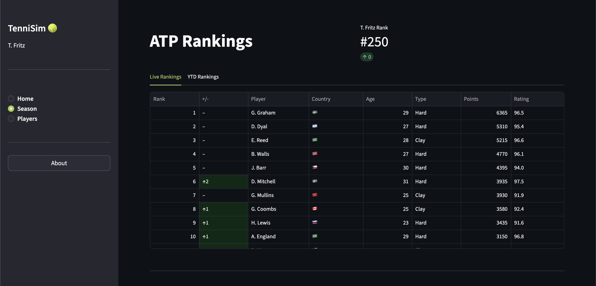

# TenniSim
> [🌐 Live Application](https://tennis-sim.streamlit.app/)

*ATP Tennis simulation game using Streamlit for Python*

## Objectives

- Create a realistic ATP career simulation game
- Use Python for backend logic
- Deploy as a front-end web application

## Technologies used

- Streamlit hosting for live web app
- Python for simulation logic
- Pandas and NumPy for data handling

## Skills developed

- Python logic scripting
- Web app deployment with Streamlit
- Data visualization

---

_View the_ [Source Code](https://github.com/peytonjpope/tennis-sim)
